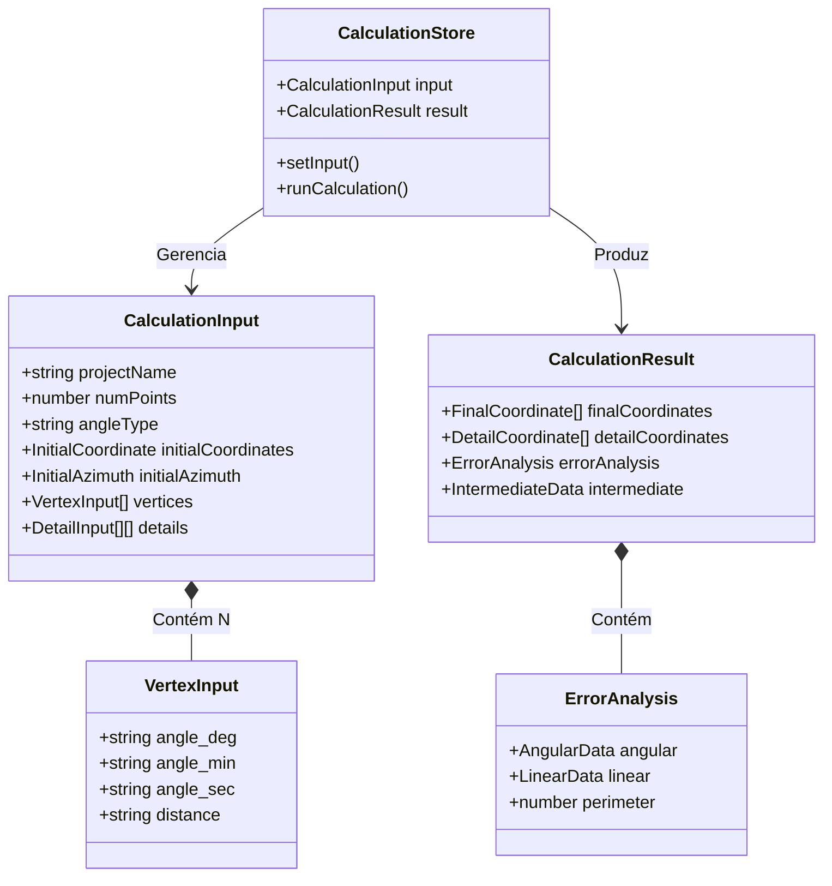
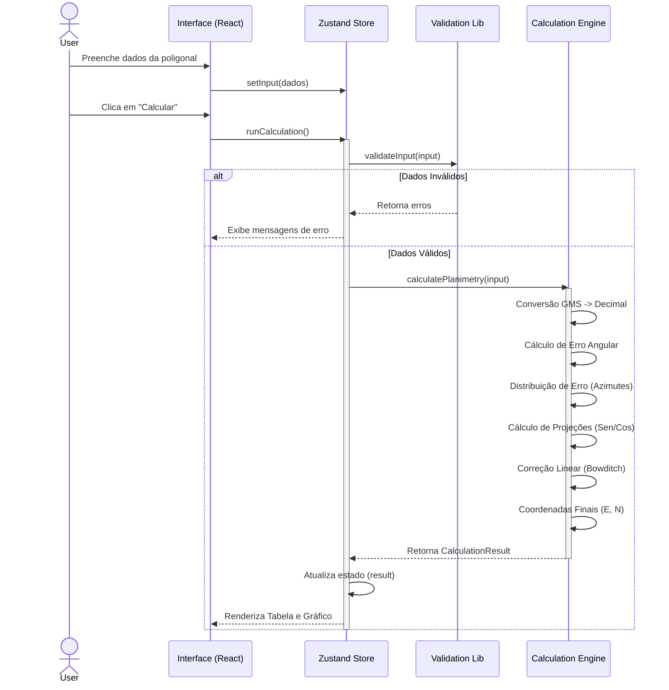

# TOPLAN NG - Sistema de Cálculos Topográficos

[](https://toplan-planimetria.netlify.app/)
[](https://nextjs.org/)

O **TOPLAN NG** (Next Generation) é uma aplicação web progressiva (PWA) moderna, desenvolvida para auxiliar no ensino e na prática de topografia. A ferramenta permite o cálculo, ajuste e visualização de poligonais planimétricas e irradiações, com foco em usabilidade móvel e precisão técnica.

🔗 **Acesse a aplicação:** [https://toplan-planimetria.netlify.app/](https://toplan-planimetria.netlify.app/)

-----

## 📜 Histórico e Contexto

Este projeto é uma iniciativa interdisciplinar do **CEFET-MG** (Campus Curvelo), unindo os departamentos de Eletroeletrônica e Engenharia Civil e Meio Ambiente.

  * **Origem (TOPO-JAVA):** O projeto é a evolução direta do software "TOPO-JAVA" (2018), originalmente uma aplicação desktop que resultou em publicações acadêmicas, mas que carecia de portabilidade.
  * **A Evolução (NG):** A versão atual foi reescrita do zero utilizando tecnologias web modernas para garantir acesso via navegador e dispositivos móveis, eliminando a necessidade de instalações complexas.
  * **Propósito:** Democratizar o acesso a ferramentas de cálculo topográfico para estudantes e profissionais, automatizando cálculos manuais suscetíveis a erros.

-----

## ✨ Funcionalidades Atuais

O código-fonte atual (`src/lib/calculations.ts`, `src/store`), oferece:

  * **Cálculo de Poligonal Fechada:**
      * Suporte a ângulos internos e externos.
      * Cálculo de erro de fechamento angular e linear.
      * Compensação automática (Método de Bowditch/Proporcional).
      * Cálculo de coordenadas parciais e totais (E, N).
  * **Pontos de Detalhe (Irradiações):**
      * Cálculo de múltiplos pontos irradiados a partir de cada vértice.
  * **Visualização Gráfica:**
      * Renderização da poligonal e detalhes em `HTML5 Canvas` interativo (Zoom/Pan).
      * Visualização de azimutes e orientação Norte.
  * **Gerenciamento de Dados:**
      * Persistência local de projetos (LocalStorage) para uso offline.
      * Validação de dados em tempo real.
  * **Relatórios e Exportação:**
      * Geração de relatórios técnicos em **PDF** (tabelas e croquis).
      * Exportação de dados brutos e calculados em **CSV** e **JSON**.

-----

## 🚀 Roadmap e Futuras Implementações

Com o plano de pesquisa aprovado para o ciclo 2025-2027, o sistema está em ativa expansão para se tornar uma ferramenta planialtimétrica completa:

  - [ ] **Poligonais Abertas e Enquadradas:** Implementação de métodos de cálculo para levantamentos que não retornam ao ponto de partida.
  - [ ] **Cálculo de Área e Perímetro:** Implementação analítica para poligonais fechadas.
  - [ ] **Módulo de Altimetria (3D):**
      - [ ] Nivelamento Trigonométrico.
      - [ ] Nivelamento Geométrico.
  - [ ] **Visualização 3D:** Adaptação da interface para representação altimétrica.

-----

## 🛠 Tecnologias Utilizadas

O projeto utiliza uma stack de ponta focada em performance e experiência do desenvolvedor:

  * **Core:** [Next.js 15](https://nextjs.org/) (App Router) & [React 19](https://react.dev/)
  * **Linguagem:** [TypeScript](https://www.typescriptlang.org/) (Tipagem estrita para cálculos de engenharia)
  * **Estilização:** [Tailwind CSS v4](https://tailwindcss.com/) & [Shadcn/UI](https://ui.shadcn.com/)
  * **Estado:** [Zustand](https://github.com/pmndrs/zustand) (Gerenciamento de estado global leve)
  * **Gráficos:** Canvas API & Framer Motion (Animações de UI)
  * **Utilitários:** `jspdf` (Geração de relatórios) e `lucide-react` (Ícones)

-----

## 📐 Modelagem Técnica (UML)

Abaixo estão representadas a estrutura de dados e o fluxo de cálculo da aplicação para auxiliar desenvolvedores e mantenedores.

### Diagrama de Classes (Modelo de Domínio)

Este diagrama ilustra como os dados topográficos são estruturados dentro da aplicação (baseado em `src/lib/types.ts`).



### Diagrama de Sequência (Fluxo de Cálculo)

Este diagrama descreve o processo disparado quando o usuário solicita o cálculo da poligonal (baseado em `src/store/useCalculationStore.ts` e `src/lib/calculations.ts`).



-----

## 📦 Instalação e Execução

Para rodar o projeto localmente:

1.  **Clone o repositório:**

    ```bash
    git clone https://github.com/eng-ekezia/toplan-ng.git
    cd toplan-ng
    ```

2.  **Instale as dependências:**

    ```bash
    npm install
    # ou
    yarn install
    ```

3.  **Inicie o servidor de desenvolvimento:**

    ```bash
    npm run dev
    ```

4.  **Acesse:** Abra [http://localhost:3000](http://localhost:3000) no seu navegador.

-----

## 📄 Licença e Créditos

Projeto desenvolvido no âmbito do **CEFET-MG Campus Curvelo**.

**Equipe de Pesquisa:**

  * **Coordenação:** Prof. Ezequiel Junio de Lima & Profa. Carolina Vieira de Andrade
  * **Desenvolvimento:** [Ciclo 2025-2027] Discentes dos cursos de Eletrotécnica e Edificações (PIBIC-FEM-Jr).
